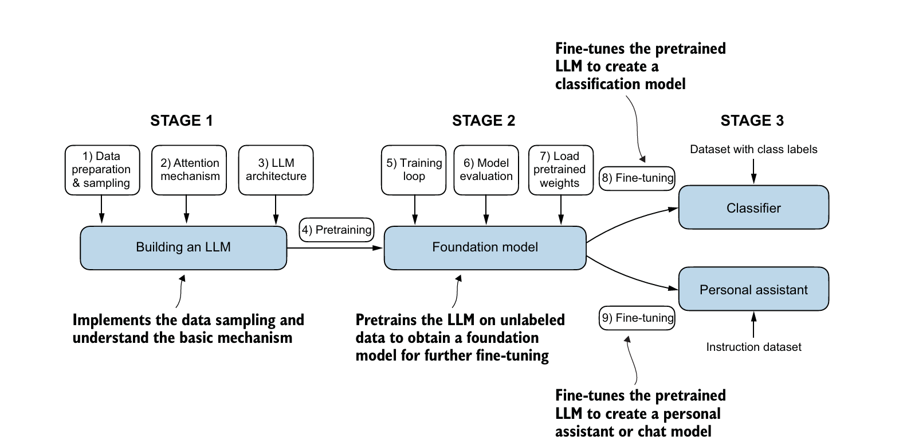
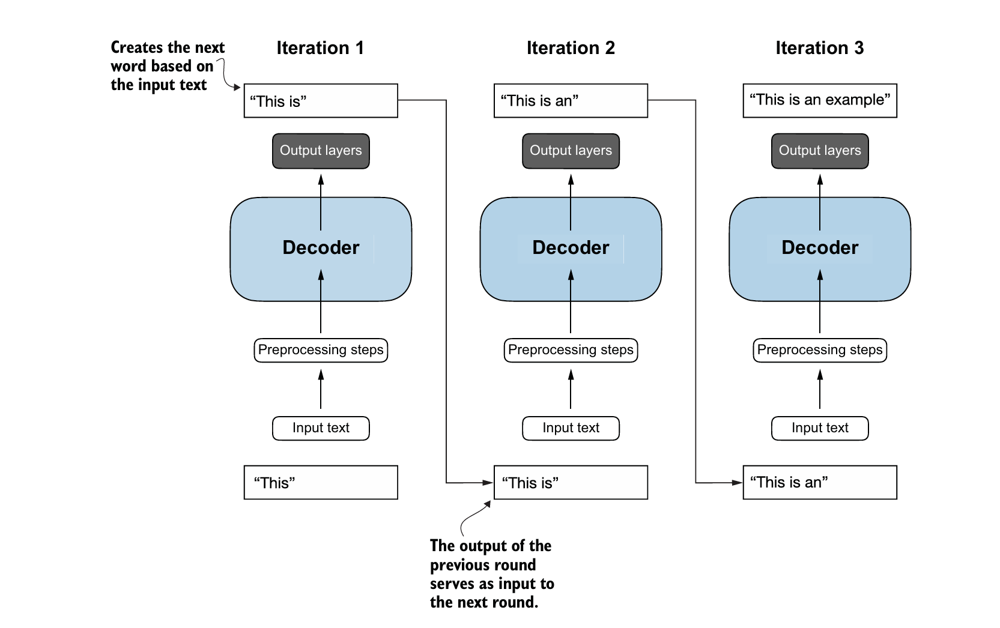
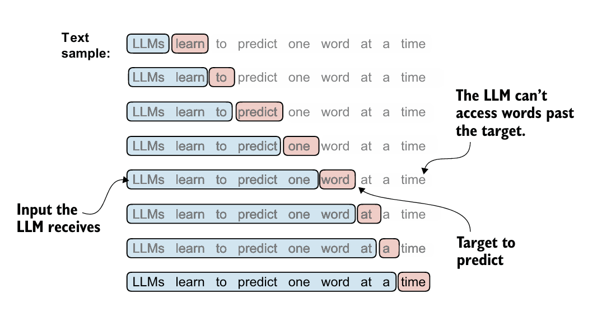
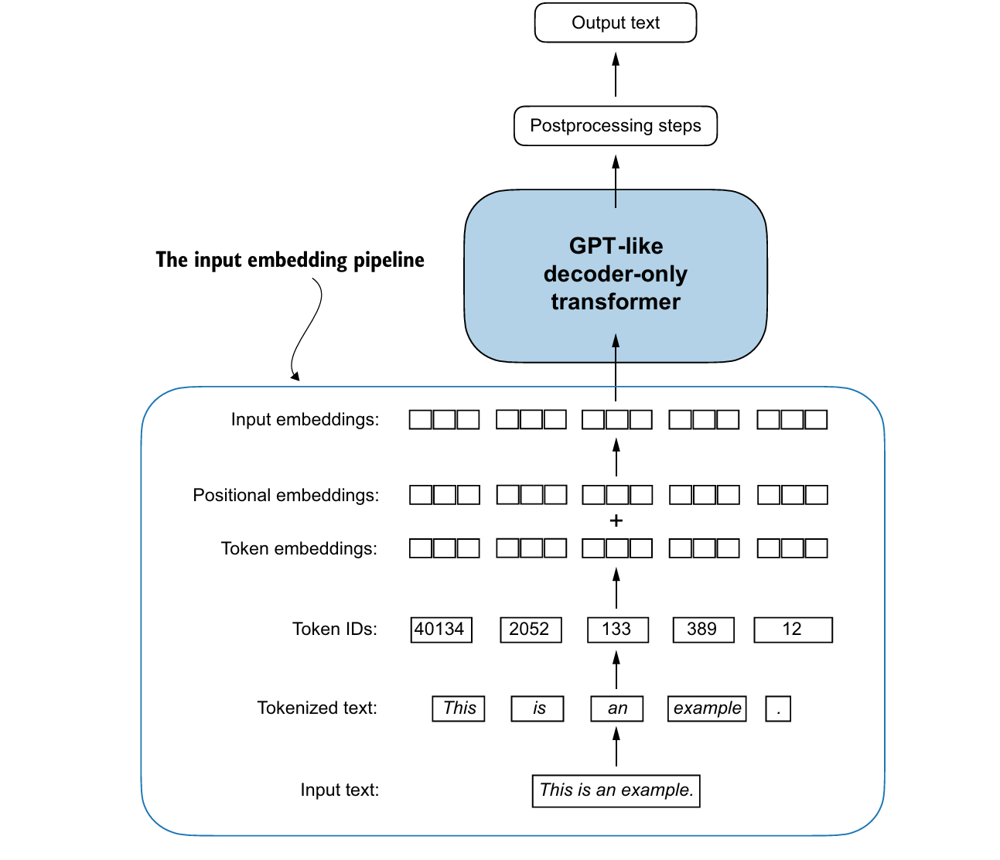
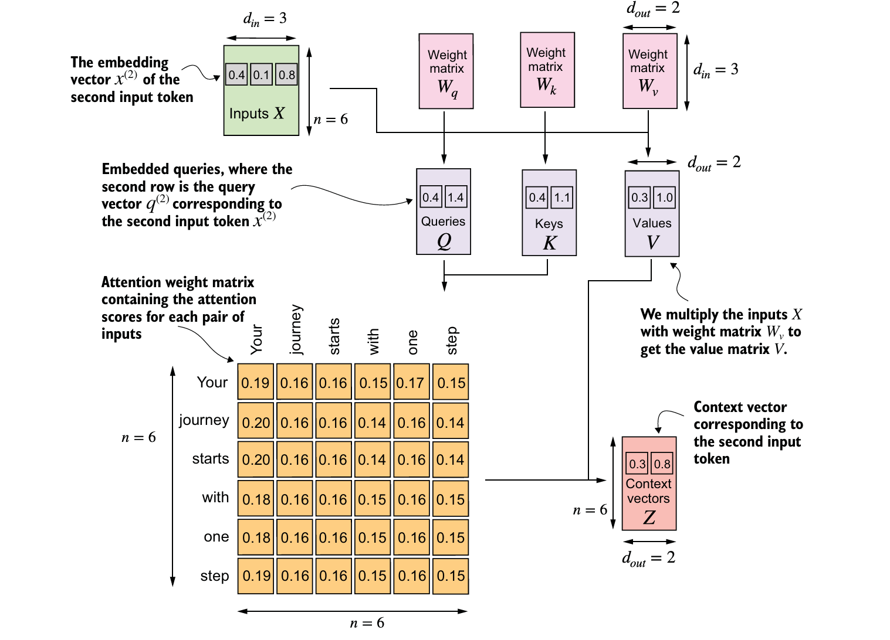
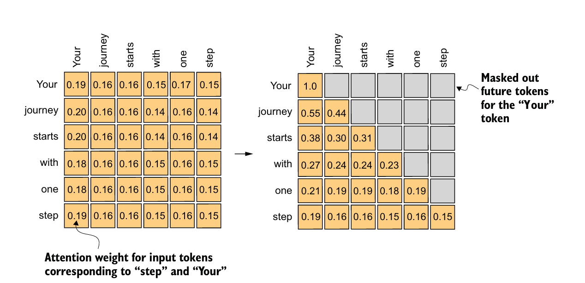
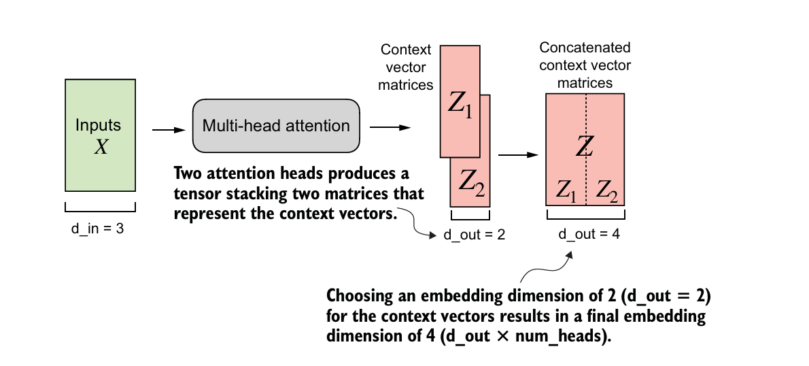
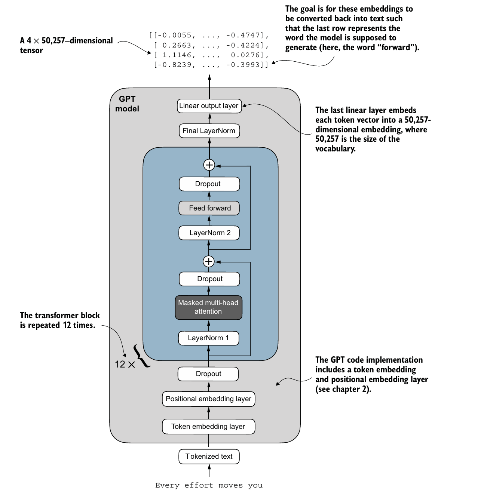

# LLM-Forge
## Understanding the Big Picture of LLMs

**Repository:** `lorendw7/LLM-Forge`

<div class="text-sm opacity-80 mt-4 leading-relaxed">
Most of the materials in this presentation are based on the GitHub repository <b>LLM-Forge</b> and the book <b>Build a Large Language Model (From Scratch)</b>, with additional explanations adapted from standard LLM / Transformer background knowledge.
</div>

<div class="text-sm opacity-70 mt-3 leading-relaxed">
日本語: 本スライドの大部分は GitHub リポジトリ <b>LLM-Forge</b> と書籍 <b>Build a Large Language Model (From Scratch)</b> に基づき、補足説明として一般的な LLM / Transformer の知識を加えています。
</div>

<div class="mt-6">

- Part I — What an LLM is  
  <span class="opacity-70">LLMとは何か</span>
- Part II — How an LLM learns  
  <span class="opacity-70">LLMはどう学習するか</span>
- Part III — How an LLM becomes useful  
  <span class="opacity-70">LLMはどう実用化されるか</span>

</div>

---
layout: section
---

# 1. The Big Picture
### 全体像



---

# Why this project matters

`LLM-Forge` is useful because it shows one complete path:

<div class="mt-4">

**text** → **tokens** → **Transformer** → **pretraining** → **fine-tuning**

</div>

Instead of treating LLMs as a black box, it breaks the system into understandable steps.

<div class="mt-6 text-sm opacity-80">
日本語:  
このプロジェクトは、LLMを「魔法」ではなく、段階的に理解できる実装として見せてくれます。
</div>

---

# One sentence summary

## An LLM is a system that:

- converts text into tokens
- predicts the next token from previous tokens
- learns this pattern at scale
- is later adapted for useful tasks

<div class="mt-6 text-sm opacity-80">
日本語:  
LLMとは、過去のトークンから次のトークンを予測し、その能力を大規模学習で獲得し、最後に実用タスクへ適応させるシステムです。
</div>

---

# The 3-stage lifecycle

| Stage | Core question | Outcome |
|---|---|---|
| Build | What is the model architecture? | A GPT-style network |
| Pretrain | How does the model learn language? | A base model |
| Fine-tune | How do we adapt it to tasks? | A useful assistant or classifier |

<div class="mt-5">
This is the main story behind the entire repository.
</div>

---
layout: section
---

# 2. What an LLM is
### LLMとは何か



---

# Core idea: next-token prediction

An autoregressive LLM learns:

$$P(x_t \mid x_{<t})$$

Meaning:

- input: all previous tokens
- output: the next token
- repeated many times across many sequences

<div class="mt-6 text-sm opacity-80">
日本語:  
自己回帰型LLMは、「これまでの並び」を見て「次に来るトークン」を予測します。
</div>

---

# From raw text to training pairs

The dataset pipeline turns text into:

- token IDs
- fixed-length windows
- shifted input / target pairs

```python
input_chunk = token_ids[i:i + max_length]
target_chunk = token_ids[i + 1:i + 1 + max_length]
```

### Intuition
- input = what the model sees
- target = the next-token answers

---

LLMs are pretrained by predicting the next word in a text



---

# Why tokenization matters

Tokenization is the bridge between language and computation.

Without it:

- the model cannot process text numerically
- training cannot be framed as prediction over a vocabulary

### Big picture
A lot of LLM behavior starts with how text is segmented.

<div class="mt-6 text-sm opacity-80">
日本語: トークン化は、自然言語を計算可能な単位へ変換する入口です。
</div>

---



---

# Embeddings: turning IDs into vectors

The model begins with two embeddings:

- **token embedding**: what the token is
- **position embedding**: where the token is

```python
tok_emb = nn.Embedding(vocab_size, emb_dim)
pos_emb = nn.Embedding(context_length, emb_dim)
```

### Why both matter
Meaning alone is not enough; order also matters.

---

# Attention: the central mechanism

Self-attention lets each token look at other tokens and decide what matters.

$$Q = XW_Q, \quad K = XW_K, \quad V = XW_V$$

$$\text{Attention}(Q,K,V)=\text{softmax}\left(\frac{QK^T}{\sqrt{d_k}}\right)V$$

### Intuition
- Query: what I need
- Key: what I offer
- Value: what I send

---



---
# Scaled Dot-Product Self-Attention Mathematical Formulation
## Fully Corresponding to the Provided Diagram
Variable definitions strictly match all symbols ($d_{in},d_{out},n,X,Q,K,V,A,Z$) and data dimensions in the figure.

---

## 1. Linear Projection: Input Embedding → Query / Key / Value
Map original input token embedding matrix $X$ to Query $Q$, Key $K$, Value $V$ matrices via 3 trainable projection weight matrices.

### Mathematical Formula
$$
\begin{align*}
Q &= X W_q \\
K &= X W_k \\
V &= X W_v
\end{align*}
$$

---

### English Explanation
- $X \in \mathbb{R}^{n \times d_{in}}$: Input token embedding matrix
  $n=6$ (total number of input tokens), $d_{in}=3$ (dimension of each input token embedding vector)
- $W_q,W_k,W_v \in \mathbb{R}^{d_{in} \times d_{out}}$: Trainable learnable weight projection matrices
- $Q,K,V \in \mathbb{R}^{n \times d_{out}}$: Projected Query, Key, Value matrices
  $d_{out}=2$ (output dimension after attention projection)
- $q^{(2)} \in \mathbb{R}^{1 \times d_{out}}$: Query vector of the **2nd input token**, which is exactly the second row of matrix $Q$ in the diagram

---

## 2. Compute Raw Unnormalized Attention Scores
Calculate pairwise dot-product similarity scores between every Query vector and every Key vector.

### Mathematical Formula
$$
\text{Raw Attention Score} = Q K^\top
$$

### English Explanation
- $K^\top$: Matrix transpose of Key matrix $K$
- Output shape: $\boldsymbol{n \times n}$ (6×6 matrix, exactly the orange attention score matrix in your diagram)
- Each entry $\text{score}_{ij}$: Similarity attention score between the query vector of token $i$ and the key vector of token $j$

---

## 3. Scaled Dot Product + Softmax Normalization
Scale raw scores to avoid gradient saturation, then apply row-wise Softmax to get normalized attention weights (each row sums to 1).

### Mathematical Formula
$$
A = \text{Softmax}\left( \frac{Q K^\top}{\sqrt{d_{out}}} \right)
$$

### English Explanation
- $\sqrt{d_{out}}$: Scaling factor, used to stabilize the variance of dot-product scores
- $A \in \mathbb{R}^{n \times n}$: Final normalized attention weight matrix (the orange attention weight matrix in the diagram)
- Each row of matrix $A$: Attention weight distribution of one input token over all 6 input tokens

---

## 4. Compute Final Context Vectors
Weighted sum of all Value vectors, using attention weights $A$ as coefficients, to get output context vectors.

### Mathematical Formula
$$
Z = A V
$$

### English Explanation
- $Z \in \mathbb{R}^{n \times d_{out}}$: Full context vector matrix for all input tokens
- $z^{(2)} \in \mathbb{R}^{1 \times d_{out}}$: Context vector corresponding to the **2nd input token**, which is the second row of matrix $Z$ (pink context vector box in the diagram)
- Each context vector is a weighted aggregation of all value vectors in $V$, weighted by normalized attention scores.

---

## Complete Compact Self-Attention Formula
Combine all 4 steps into the standard unified scaled dot-product attention formula:
$$
\boldsymbol{\text{Self-Attention}(X) = \text{Softmax}\left( \frac{X W_q (X W_k)^\top}{\sqrt{d_{out}}} \right) X W_v}
$$

---

# Why causal masking is essential

A GPT-style model must not see future tokens during training.

```python
self.register_buffer(
    "mask",
    torch.triu(torch.ones(context_length, context_length), diagonal=1)
)
```

### Why it matters
- prevents answer leakage
- matches training with generation
- preserves left-to-right prediction

<div class="mt-6 text-sm opacity-80">
日本語: 因果マスクは、未来情報の漏洩を防ぎ、学習条件と生成条件を一致させます。
</div>

---



---

# Why multiple attention heads?

Multi-head attention gives the model multiple views of the same sequence.

Different heads may capture:

- local syntax
- long-range dependency
- separators and structure
- topic continuity

### Big idea
One head is one pattern detector; many heads create richer relational reasoning.

---
# Multi-Head Attention Mechanism
## Fully Matches the Provided Diagram (2 Attention Heads, $d_{in}=3$, Single Head $d_{out}=2$)
Concise & accurate English explanations + mathematical formulas.

---

## Core Concept
Multi-Head Attention splits attention computation into **multiple independent parallel single attention heads**, extracts different types of contextual information from each head, then concatenates all head outputs to get the final feature.

This diagram uses **2 attention heads** as example.

---



---

## Step 1: Independent Single Head Attention Calculation
Each attention head runs the scaled dot-product self-attention independently with its own trainable projection weights $W_q^h,W_k^h,W_v^h$.

For head $h$ ($h=1,2$ in this diagram):
$$
Z_h = \text{SelfAttention}_h(X)
= \text{Softmax}\left( \frac{X W_q^h (X W_k^h)^\top}{\sqrt{d_{head}}} \right) X W_v^h
$$

### English Explanation
- Each head $h$ outputs a context matrix $Z_h$
- In diagram: each single head has output dimension $d_{head}=d_{out}=2$
- All heads process the same input embedding matrix $X$ in parallel
- Heads do not share weights, each learns different attention patterns

---

## Step 2: Concatenate All Head Outputs
Horizontally concatenate context matrices from every attention head along the feature dimension.

Formula for 2 heads:
$$
Z = \text{Concat}(Z_1,\;Z_2)
$$

### English Explanation
- $Z_1$: Context matrix from head 1
- $Z_2$: Context matrix from head 2
- Concatenation is done on the embedding dimension (columns)
- Final concatenated dimension = single head dimension × number of heads
- In diagram: final $d_{out}=2 \times 2=4$

---

### What problem does it solve?

`Multi-Head Attention` lets each token look at other tokens in the sequence and decide **which information is important**.  
In decoder-style attention, we also use a **causal mask** so that a token cannot see future tokens.

> Multi-Head Attention allows the model to attend to different positions in parallel.  
> Each head learns a different view of the sequence.  
> The causal mask ensures autoregressive decoding.

---

## Multi-Head Attention Implementation

### Input / Output

Explain only the interface first.

```python
class MultiHeadAttention(nn.Module):
    def __init__(self, d_in, d_out, context_length, dropout, num_heads):
        ...
```

- `d_in`: input dimension of each token
- `d_out`: output dimension after attention
- `num_heads`: number of parallel attention heads
- `context_length`: maximum sequence length for the mask

---

### Q, K, V projection

Show only the projection part.

```python
self.W_query = nn.Linear(d_in, d_out, bias=qkv_bias)
self.W_key   = nn.Linear(d_in, d_out, bias=qkv_bias)
self.W_value = nn.Linear(d_in, d_out, bias=qkv_bias)
```

- The same input `x` is projected into three spaces:
  - **Query**: what this token is looking for
  - **Key**: what this token offers
  - **Value**: the actual information carried by the token

---

### Split into multiple heads

Show the reshape + transpose logic.

```python
queries = queries.view(b, num_tokens, self.num_heads, self.head_dim).transpose(1, 2)
keys    = keys.view(b, num_tokens, self.num_heads, self.head_dim).transpose(1, 2)
values  = values.view(b, num_tokens, self.num_heads, self.head_dim).transpose(1, 2)
```

---

### Attention scores + mask
This is the most important slide.

```python
attn_scores = queries @ keys.transpose(2, 3)
mask_bool = self.mask.bool()[:num_tokens, :num_tokens]
attn_scores.masked_fill_(mask_bool, -torch.inf)
attn_weights = torch.softmax(attn_scores / keys.shape[-1]**0.5, dim=-1)
```

---

### Weighted sum + output projection
Show the final aggregation.

```python
context_vec = (attn_weights @ values)
context_vec = context_vec.transpose(1, 2).contiguous().view(b, num_tokens, self.d_out)
context_vec = self.out_proj(context_vec)
```

---

## Code Snippet

```python {*}{maxHeight:'60vh'}
import torch
import torch.nn as nn


class MultiHeadAttention(nn.Module):
    def __init__(self, d_in, d_out, context_length, dropout, num_heads, qkv_bias=False):
        super().__init__()

        assert d_out % num_heads == 0, "d_out must be divisible by num_heads"

        self.d_out = d_out
        self.num_heads = num_heads
        self.head_dim = d_out // num_heads

        # Linear projections for Q, K, V
        self.W_query = nn.Linear(d_in, d_out, bias=qkv_bias)
        self.W_key = nn.Linear(d_in, d_out, bias=qkv_bias)
        self.W_value = nn.Linear(d_in, d_out, bias=qkv_bias)

        self.out_proj = nn.Linear(d_out, d_out)
        self.dropout = nn.Dropout(dropout)

        # Causal mask: future tokens are blocked
        # 未来のtokenを見えないようにする
        self.register_buffer(
            "mask",
            torch.triu(torch.ones(context_length, context_length), diagonal=1)
        )

    def forward(self, x):
        # x: [batch_size, num_tokens, d_in]
        b, num_tokens, _ = x.shape

        # Step 1: project input into Q, K, V
        queries = self.W_query(x)
        keys = self.W_key(x)
        values = self.W_value(x)

        # Step 2: split into multiple heads
        # 各headで並列にattentionを計算する
        queries = queries.view(b, num_tokens, self.num_heads, self.head_dim).transpose(1, 2)
        keys = keys.view(b, num_tokens, self.num_heads, self.head_dim).transpose(1, 2)
        values = values.view(b, num_tokens, self.num_heads, self.head_dim).transpose(1, 2)

        # Step 3: compute attention scores
        attn_scores = queries @ keys.transpose(2, 3)

        # Step 4: apply causal mask
        mask_bool = self.mask.bool()[:num_tokens, :num_tokens]
        attn_scores.masked_fill_(mask_bool, -torch.inf)

        # Step 5: normalize scores into attention weights
        # softmaxで重み化する
        attn_weights = torch.softmax(attn_scores / (self.head_dim ** 0.5), dim=-1)
        attn_weights = self.dropout(attn_weights)

        # Step 6: weighted sum of value vectors
        context_vec = attn_weights @ values

        # Step 7: merge heads
        context_vec = context_vec.transpose(1, 2).contiguous().view(b, num_tokens, self.d_out)

        # Step 8: final output projection
        output = self.out_proj(context_vec)
        return output
```

---

## One-line summary

**Multi-Head Attention = project to Q/K/V → split into heads → compute masked attention → aggregate values → merge heads**


---

# A Transformer block in one view

A typical block contains:

1. LayerNorm
2. Multi-head attention
3. Residual connection
4. Feed-forward network
5. Another residual path

### Mental model
- attention = communication across tokens
- FFN = computation inside each token
- residuals = stable information flow

---



---

# What the model finally outputs

The final layer projects hidden states back to the vocabulary:

```python
self.out_head = nn.Linear(emb_dim, vocab_size, bias=False)
```

So at each position, the model produces:

- a score for every token in the vocabulary
- then a probability distribution after softmax

### This is how generation starts.

---

# Part I takeaway

## The architecture story is:

**tokens** → **embeddings** → **attention** → **Transformer blocks** → **logits**

This is the structural heart of a GPT-style LLM.

<div class="mt-6 text-sm opacity-80">
日本語: Part I は、LLMの「構造」を理解する段階です。
</div>

---
layout: section
---

# 3. How an LLM learns
### LLMはどう学習するか

---

# Pretraining in one sentence

Pretraining teaches the model broad language patterns from raw text.

### Why raw text is enough
Because the supervision is built into the sequence itself:

- prefix = input
- next token = target

This is **self-supervised learning**.

---

# The training objective

The standard objective is next-token cross-entropy loss.

### What it does
It pushes the model to assign high probability to the correct next token.

### Why it matters
When repeated over massive data, this simple objective builds surprisingly general language capability.

<div class="mt-6 text-sm opacity-80">
日本語: 単純な次トークン予測でも、大量データで繰り返すと汎用的な言語能力が形成されます。
</div>

---

# The training loop

```python
optimizer.zero_grad()
loss = calc_loss_batch(input_batch, target_batch, model, device)
loss.backward()
optimizer.step()
```

### Four actions
- clear old gradients
- compute loss
- backpropagate
- update parameters

This is the basic engine of learning.

---

# What makes training stable?

In practice, a working LLM pipeline needs more than a forward pass.

Common ingredients include:

- **AdamW** for optimization
- **learning-rate scheduling** for stable convergence
- **gradient clipping** for guardrails

### Big picture
Architecture gives capacity; optimization turns that capacity into learned behavior.

---

# How do we know the model is improving?

A serious training workflow tracks both:

- training loss
- validation loss
- sampled generations
- tokens seen / compute budget

### Why this matters
Loss curves show learning trends. Samples show actual behavior.

---

# What pretraining really gives us

After pretraining, the model becomes a **base model**.

It usually learns:

- statistical language patterns
- syntax and local structure
- some reusable representations

It does **not automatically** become:

- a reliable assistant
- a task specialist
- a safe product

---

# Part II takeaway

## Pretraining turns structure into capability.

Part I builds the machine.  
Part II teaches the machine language.

<div class="mt-6 text-sm opacity-80">
日本語: Part II は、モデルに言語の規則性を学ばせる段階です。
</div>

---
layout: section
---

# 4. How an LLM becomes useful
### LLMはどう実用化されるか

---

# Why fine-tuning exists

A pretrained model is general, but not yet aligned to a specific use.

Fine-tuning adapts the base model for:

- classification
- instruction following
- domain specialization
- product constraints

### Big picture
Pretraining builds broad knowledge; fine-tuning shapes behavior.

---

# Example 1: classification

In classification, the goal changes.

- pretraining: predict the next token
- classification: output a label

Examples:

- spam vs ham
- sentiment categories
- intent classes

### So what changes?
- data format
- output interpretation
- metrics

---

# Example 2: instruction tuning

Instruction tuning teaches the model to respond in a task-oriented format.

Typical structure:

- instruction
- optional input
- response

### Why it matters
The model learns not only language continuation, but also how to behave like an assistant.

<div class="mt-6 text-sm opacity-80">
日本語: 指示チューニングは、モデルを「続き生成器」から「応答システム」へ近づけます。
</div>

---

# Data format is part of the training signal

Prompt templates are not cosmetic.

They teach the model:

- where the task begins
- what counts as context
- what style the answer should follow

### Important point
In LLM systems, **data formatting** is often as important as model architecture.

---

# Full fine-tuning vs PEFT

There are two broad adaptation strategies:

- **full fine-tuning**: update all parameters
- **PEFT**: update a small subset or added modules

### Why PEFT matters
- lower memory cost
- faster experimentation
- easier to maintain multiple task variants

Examples: LoRA, adapters

---

# From base model to assistant

A useful assistant usually emerges through layers of adaptation:

1. pretraining for general language ability
2. supervised fine-tuning for task behavior
3. sometimes extra alignment and safety stages

### Key idea
A chat model is not only a model architecture. It is a trained and behavior-shaped system.

---

# Part III takeaway

## Fine-tuning turns capability into usefulness.

Part III is where the model starts to match human tasks and product needs.

<div class="mt-6 text-sm opacity-80">
日本語: Part III は、モデルを「使える形」に整える段階です。
</div>

---
layout: section
---

# 5. Final synthesis
### まとめ

---

# The complete LLM story

## A simple way to remember it

- **Build** the architecture
- **Pretrain** on large-scale text
- **Fine-tune** for target behavior

---

# Final takeaway

A compact repo, but a complete story:

**data → attention → GPT → pretraining → fine-tuning**

<div class="mt-6 text-sm opacity-80">
日本語: 小さな実装ですが、LLM開発全体の流れを学べる教材です。
</div>

---

# Sources and Attribution

## Main materials used in this slide deck

- **Primary repository:** `lorendw7/LLM-Forge`
- **Book structure referenced:** *Build a Large Language Model (From Scratch)*
- **Supporting materials:**
  - project README and source files
  - notebooks for pretraining, classification, and instruction tuning
  - standard Transformer / GPT concepts used for explanation

> Most of the materials in this presentation are based on the GitHub repository **LLM-Forge** and the book *Build a Large Language Model (From Scratch)*, with additional explanations adapted from standard LLM / Transformer background knowledge.

<span class="opacity-70">
本スライドの大部分は GitHub リポジトリ **LLM-Forge** と書籍 *Build a Large Language Model (From Scratch)* に基づき、補足説明として一般的な LLM / Transformer の知識を加えています。
</span>

---

# Thank You

## LLM-Forge as a learning path

A compact repo, but a complete story:

**data → attention → GPT → pretraining → fine-tuning**
